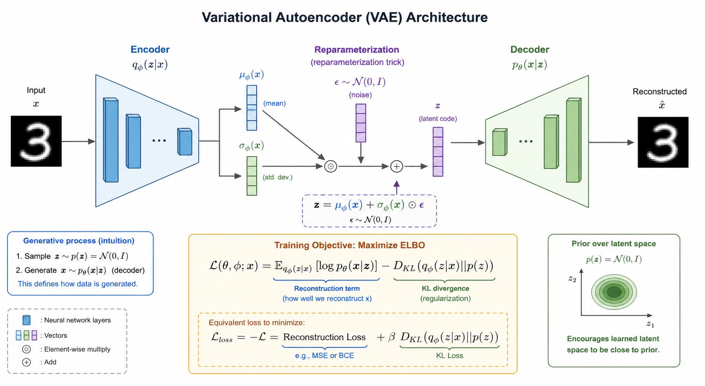
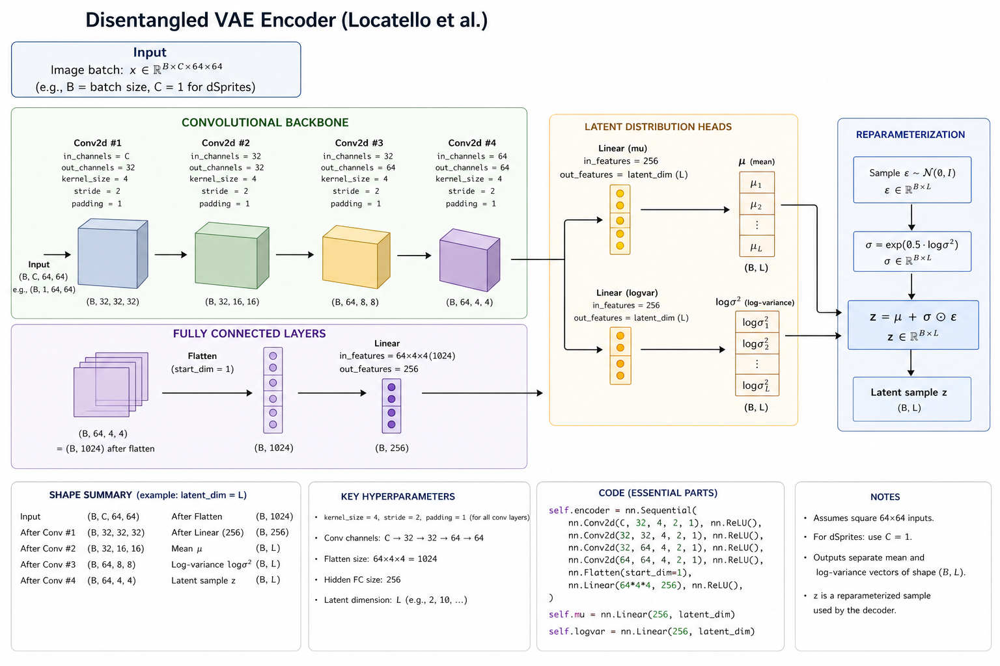
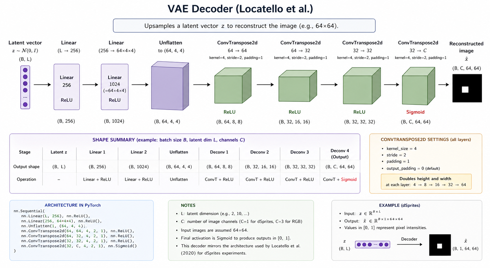

# VAE on dSprites: Project Guide

> **Current phase:** Phase 2 — Representation Learning Baseline  
> **Goal:** Train a standard VAE on dSprites, validate the training pipeline, and establish a clean baseline before introducing structured splits (correlated, held-out) and more sophisticated architectures.

---

## Table of Contents

1. [Research Context](#1-research-context)
2. [The dSprites Dataset](#2-the-dsprites-dataset)
3. [Model Architecture](#3-model-architecture)
4. [The Loss Function (ELBO)](#4-the-loss-function-elbo)
5. [Code Walkthrough](#5-code-walkthrough)
6. [Configuration](#6-configuration)
7. [Training Guide & wandb](#7-training-guide--wandb)
8. [Interpreting Results](#8-interpreting-results)
9. [Interactive Reconstruction Browser](#9-interactive-reconstruction-browser)
10. [What Comes Next](#10-what-comes-next)

---

## 1. Research Context

### 1.1 The Core Question

Can a VAE that is trained on data where two generative factors are _correlated_ still learn to represent those factors independently?

Concretely: if every large shape in training is also highly rotated (and every small shape is barely rotated), does the latent space entangle "scale" and "orientation" into a single direction — or does it tease them apart?

This is the question of **compositional generalisation**. A truly disentangled model should be able to imagine a large shape at any rotation, even combinations it never saw during training. An entangled model cannot.

### 1.2 Three Experimental Conditions

We test this with three dataset splits, each designed to reveal a different failure mode.

| Split | Training data | What it tests |
|---|---|---|
| **IID** | Random 70 / 15 / 15 split | Baseline disentanglement under i.i.d. conditions |
| **Correlated** | Only concordant (scale, orientation) pairs | Whether the encoder entangles two correlated factors |
| **Held-out pair** | All images _except_ (shape=heart, scale=large) | Whether the model can reconstruct factor combinations it never saw |

**We are currently building the IID baseline.** Once this pipeline is solid, the same training script will be reused on the structured splits with minimal changes.

### 1.3 Why dSprites?

dSprites (Matthey et al., 2017) is the canonical benchmark for studying disentanglement. Every image is a white 2D shape on a black background, generated by exactly 6 independent ground-truth factors. We know exactly what the generative factors are — this makes it possible to measure disentanglement objectively.

---

## 2. The dSprites Dataset

### 2.1 Structure

```
737,280 images  ×  64 × 64 pixels  (binary: {0, 1})
```

Each image is uniquely determined by a combination of 6 generative factors:

| Factor | # Classes | Values |
|--------|-----------|--------|
| **color** | 1 | always white — this factor is constant |
| **shape** | 3 | square (0), ellipse (1), heart (2) |
| **scale** | 6 | 0.5, 0.6, 0.7, 0.8, 0.9, 1.0 |
| **orientation** | 40 | evenly spaced 0° → 360° |
| **pos_x** | 32 | 0 → 31 pixels (left → right) |
| **pos_y** | 32 | 0 → 31 pixels (top → bottom) |

Total: $1 \times 3 \times 6 \times 40 \times 32 \times 32 = 737{,}280$

### 2.2 Loading and Splitting

```python
from src.datasets.dsprites import load_dsprites, make_iid_split, DSpritesDataset

# Auto-downloads ~80 MB on first call, cached to data/dsprites.npz
dataset = load_dsprites("data")

# Returns three numpy index arrays
train_idx, val_idx, test_idx = make_iid_split(
    dataset,
    train_frac=0.70,   # 516,096 images
    val_frac=0.15,     #  110,592 images
    seed=42,
)

# PyTorch Dataset: __getitem__ returns (img[1,64,64], latents[6])
train_ds = DSpritesDataset(dataset, train_idx)
img, latents = train_ds[0]
# img.shape   →  (1, 64, 64)  float32  values in {0.0, 1.0}
# latents     →  tensor([0, 1, 3, 12, 7, 20])  — class indices for each factor
```

**Key design decision:** `DSpritesDataset` returns the raw binary values as float32. There is no further normalisation — the images are already in $[0, 1]$, which matches the Sigmoid output of the decoder.

### 2.3 The `make_iid_split` Function

```python
def make_iid_split(dataset, train_frac=0.7, val_frac=0.15, seed=42):
    n = len(dataset["imgs"])           # 737,280
    rng = np.random.RandomState(seed)
    indices = np.arange(n)
    rng.shuffle(indices)               # reproducible shuffle

    n_train = int(n * train_frac)      # 516,096
    n_val   = int(n * val_frac)        # 110,592

    return (
        indices[:n_train],
        indices[n_train : n_train + n_val],
        indices[n_train + n_val :],    # ~110,592
    )
```

This is a simple but correct split. The shuffle is seeded so results are reproducible. The `test_idx` is never touched during training — it is reserved for final evaluation.

---

## 3. Model Architecture

### 3.1 The Variational Autoencoder

A VAE learns a _probabilistic_ latent representation rather than a deterministic one. The encoder maps an image to a distribution over the latent space; the decoder maps a sample from that distribution back to pixel space.



The key intuition: by forcing the encoder to output a _distribution_ (mean $\mu$ and log-variance $\log\sigma^2$) instead of a single point, the model learns a smooth, structured latent space where nearby points decode to semantically similar images.

### 3.2 Full Architecture (Single Forward Pass)


The architecture used here follows Locatello et al. (2019), the standard benchmark for dSprites disentanglement:

**Input** → $(B, 1, 64, 64)$ — a batch of binary grayscale images.

### 3.3 The Encoder $q_\phi(z \mid x)$



The encoder is a convolutional backbone that compresses the image to a compact feature vector, then splits into two linear heads — one for $\mu$ and one for $\log\sigma^2$.

```
Input:    (B, 1, 64, 64)
Conv2d(1 → 32,  k=4, s=2, p=1) + ReLU  →  (B, 32, 32, 32)
Conv2d(32 → 32, k=4, s=2, p=1) + ReLU  →  (B, 32, 16, 16)
Conv2d(32 → 64, k=4, s=2, p=1) + ReLU  →  (B, 64,  8,  8)
Conv2d(64 → 64, k=4, s=2, p=1) + ReLU  →  (B, 64,  4,  4)
Flatten                                 →  (B, 1024)
Linear(1024 → 256) + ReLU              →  (B, 256)
# -----------------------------------------------
Linear(256 → latent_dim)               →  mu      (B, d)
Linear(256 → latent_dim)               →  log_var (B, d)
```

Each spatial stride-2 convolution halves the spatial resolution: $64 \to 32 \to 16 \to 8 \to 4$.

### 3.4 Reparameterisation Trick

To allow gradients to flow through the stochastic sampling step:

$$z = \mu + \sigma \odot \varepsilon, \qquad \varepsilon \sim \mathcal{N}(0, I)$$

where $\sigma = \exp(0.5 \cdot \log\sigma^2)$. This is equivalent to sampling $z \sim \mathcal{N}(\mu, \sigma^2 I)$ but with a path that gradients can traverse.

```python
def reparameterize(self, mu, logvar):
    std = torch.exp(0.5 * logvar)   # σ = exp(½ log σ²)
    eps = torch.randn_like(std)     # ε ~ N(0, I)
    return mu + eps * std           # z ~ N(μ, σ²I)
```

### 3.5 The Decoder $p_\theta(x \mid z)$



The decoder mirrors the encoder: it takes a latent vector $z \in \mathbb{R}^d$ and upsamples it back to $64 \times 64$.

```
Input:    (B, d)
Linear(d → 256)  + ReLU          →  (B, 256)
Linear(256 → 1024) + ReLU        →  (B, 1024)
Unflatten(64, 4, 4)              →  (B, 64,  4,  4)
ConvTranspose2d(64→64, k=4,s=2)  →  (B, 64,  8,  8)
ConvTranspose2d(64→32, k=4,s=2)  →  (B, 32, 16, 16)
ConvTranspose2d(32→32, k=4,s=2)  →  (B, 32, 32, 32)
ConvTranspose2d(32→ 1, k=4,s=2)  →  (B,  1, 64, 64)
Sigmoid                          →  pixel values ∈ [0, 1]
```

The Sigmoid ensures output pixel values are in $[0,1]$, matching the binary input distribution.

---

## 4. The Loss Function (ELBO)

### 4.1 The Objective

We train by maximising the **Evidence Lower BOund (ELBO)**:

$$\log p_\theta(x) \geq \underbrace{\mathbb{E}_{q_\phi(z|x)}\left[\log p_\theta(x \mid z)\right]}_{\text{Reconstruction}} - \underbrace{D_\text{KL}\!\left(q_\phi(z \mid x) \;\|\; p(z)\right)}_{\text{KL Regularisation}}$$

We _maximise_ the ELBO, which is equivalent to _minimising_:

$$\mathcal{L} = \underbrace{\mathcal{L}_\text{recon}}_{\text{MSE}} + \beta \cdot \underbrace{\mathcal{L}_\text{KL}}_{\text{KL divergence}}$$

### 4.2 Reconstruction Loss

For binary images with continuous decoder outputs, we use **MSE**:

$$\mathcal{L}_\text{recon} = \frac{1}{HW} \sum_{i=1}^{HW} \left( x_i - \hat{x}_i \right)^2$$

PyTorch's `MSELoss(reduction='mean')` averages over both batch and pixel dimensions, giving a per-pixel average.

### 4.3 KL Divergence

With a standard Gaussian prior $p(z) = \mathcal{N}(0, I)$, the KL between the encoder distribution and the prior has a closed form:

$$D_\text{KL}\!\left(\mathcal{N}(\mu, \sigma^2) \;\|\; \mathcal{N}(0, I)\right) = -\frac{1}{2} \sum_{j=1}^{d} \left(1 + \log\sigma^2_j - \mu^2_j - \sigma^2_j\right)$$

In code, the encoder computes this **summed over the batch** and stores it:

```python
def forward(self, x):
    mu, logvar = self.encode(x)
    z = self.reparameterize(mu, logvar)
    # Sum over both batch and latent dims → scalar
    self.kl = -0.5 * torch.sum(1 + logvar - mu.pow(2) - logvar.exp())
    return z, mu, logvar
```

In the training loop we **normalise by batch size** so the KL scale is comparable to the MSE regardless of batch size:

```python
kl_loss = vae.encoder.kl / x.shape[0]   # per-sample KL
loss = recon_loss + beta * kl_loss
```

### 4.4 The $\beta$ Coefficient

Setting $\beta > 1$ (beta-VAE) upweights the KL term, pushing the encoder towards a more compressed, closer-to-Gaussian posterior. This tends to improve disentanglement at the cost of reconstruction quality. The current baseline uses $\beta = 1.0$ (standard VAE).

| $\beta$ | Effect |
|---|---|
| $< 1$ | Reconstruction dominates; latent space may not be well-regularised |
| $= 1$ | Standard VAE; balanced ELBO |
| $> 1$ | KL dominates; latent space forced towards $\mathcal{N}(0,I)$; better disentanglement but blurrier reconstructions |

### 4.5 Numerical Example

Suppose the encoder outputs for a single sample with $d = 4$ latent dimensions:

$$\mu = [0.8,\ -0.3,\ 0.1,\ 1.2], \qquad \log\sigma^2 = [-0.5,\ -1.2,\ -0.1,\ -2.0]$$

Then the per-sample KL is:

$$\mathcal{L}_\text{KL} = -\frac{1}{2}\sum_j \left(1 + \log\sigma^2_j - \mu^2_j - e^{\log\sigma^2_j}\right)$$

$$= -\frac{1}{2}\Big[(1 - 0.5 - 0.64 - 0.607) + (1 - 1.2 - 0.09 - 0.301) + (1 - 0.1 - 0.01 - 0.905) + (1 - 2.0 - 1.44 - 0.135)\Big]$$

$$\approx -\frac{1}{2}\left[-0.747 + (-0.591) + (-0.015) + (-2.575)\right] \approx 1.96$$

A well-trained VAE will drive this towards 0 for each dimension that encodes a meaningful factor, and all the way to 0 for "inactive" dimensions (where $\mu \approx 0$, $\sigma^2 \approx 1$).

---

## 5. Code Walkthrough

### 5.1 `train_epoch` — One Pass Through the Data

```python
def train_epoch(vae, device, loader, optimizer, criterion, beta):
    vae.train()
    total_recon = total_kl = 0.0

    for x, _ in loader:               # x: (B, 1, 64, 64); labels discarded
        x = x.to(device)

        # -- 1) Forward pass --
        x_hat, _, _ = vae(x)          # vae() returns (recon, mu, logvar)

        # -- 2) Compute losses --
        recon_loss = criterion(x_hat, x)          # MSE, already per-pixel mean
        kl_loss    = vae.encoder.kl / x.shape[0]  # sum KL → per-sample mean
        loss       = recon_loss + beta * kl_loss

        # -- 3) Backward --
        optimizer.zero_grad()
        loss.backward()
        optimizer.step()

        total_recon += recon_loss.item()
        total_kl    += kl_loss.item()

    n = len(loader)
    return total_recon / n, total_kl / n   # averaged over batches
```

> **Why `_ , _` for `mu` and `logvar`?** We don't need them in the loss computation — the encoder already stored the KL in `self.kl` during the forward pass. We do use `mu` and `logvar` during PCA manifold generation.

### 5.2 `make_pca_manifold` — Visualising the Latent Space

This is the primary tool for diagnosing whether the VAE has learned a structured representation.

```python
def make_pca_manifold(vae, loader, device, n_samples=5000):
    vae.eval()
    all_mu, all_latents = [], []

    with torch.no_grad():
        for x, latents in loader:
            _, mu, _ = vae(x.to(device))   # use μ, not sampled z
            all_mu.append(mu.cpu().numpy())
            all_latents.append(latents.numpy())
            if sum(len(m) for m in all_mu) >= n_samples:
                break

    all_mu      = np.concatenate(all_mu)       # (N, latent_dim)
    all_latents = np.concatenate(all_latents)  # (N, 6)

    coords = PCA(n_components=2).fit_transform(all_mu)  # (N, 2)

    # Six subplots — one per generative factor
    for i, name in enumerate(FACTOR_NAMES):
        axes[i].scatter(coords[:, 0], coords[:, 1],
                        c=all_latents[:, i], cmap='tab10', s=4, alpha=0.5)
```

We use $\mu$ (the mean) rather than the sampled $z$ because $\mu$ is the encoder's _best estimate_ of where this image lives in latent space. Plotting sampled $z$ adds noise that obscures structure.

### 5.3 `make_recon_grid` — Checking Reconstruction Quality

```python
def make_recon_grid(vae, loader, device, n=8):
    x, _ = next(iter(loader))         # grab one batch from validation
    x = x[:n].to(device)
    with torch.no_grad():
        x_hat, _, _ = vae(x)

    # Build two-row strip: originals on top, reconstructions below
    row_orig  = np.concatenate([x[i, 0].cpu().numpy()     for i in range(n)], axis=1)
    row_recon = np.concatenate([x_hat[i, 0].cpu().numpy() for i in range(n)], axis=1)
    gap  = np.ones((4, row_orig.shape[1]))   # thin white separator
    grid = np.concatenate([row_orig, gap, row_recon], axis=0)
    return wandb.Image(grid, caption="Top: original  |  Bottom: reconstruction")
```

---

## 6. Configuration

All hyperparameters live in `configs/vae.yaml`. **Do not hard-code numbers in the training script** — change them here.

```yaml
# configs/vae.yaml

model:
  latent_dim: 10          # bottleneck dimensionality
  img_size: [1, 64, 64]  # fixed for dSprites (grayscale)

training:
  epochs: 50
  batch_size: 128
  lr: 1.0e-3
  weight_decay: 1.0e-5
  beta: 1.0              # KL weight: 1.0 = standard VAE
  seed: 42

data:
  train_frac: 0.70
  val_frac: 0.15

logging:
  wandb_project: paper2-vae
  log_interval: 5         # log images + PCA every N epochs
  n_viz: 8                # images in the reconstruction strip
  pca_samples: 5000       # val images used for PCA scatter
```

**Recommended experiments:**

| `latent_dim` | `beta` | Purpose |
|---|---|---|
| 10 | 1.0 | Standard VAE baseline |
| 10 | 4.0 | Beta-VAE, push towards disentanglement |
| 4 | 1.0 | Undercomplete bottleneck — forces compression |
| 20 | 1.0 | Overcomplete — check for posterior collapse |

These four cells are the **disentanglement sweep** — automated by `scripts/launch_sweep.sh` (Section 7.5).

### 6.1 CLI Overrides

`scripts/train_vae.py` accepts overrides that take precedence over the YAML. Useful for sweep cells, ad-hoc smoke tests, and per-node tuning without editing committed configs.

| Flag | Overrides | Notes |
|---|---|---|
| `--latent-dim N` | `model.latent_dim` | Used by sweep cells 1–4. |
| `--beta F` | `training.beta` | Floats accepted (e.g. `4.0`). |
| `--seed N` | `training.seed` | For multi-seed bars later. |
| `--epochs N` | `training.epochs` | Smoke-test in 1–2 epochs. |
| `--batch-size N` | `training.batch_size` | Otherwise from runtime overlay. |
| `--num-workers N` | (DataLoader) | Otherwise from runtime overlay. |
| `--runtime KEY` | applies overlay | `hippo` or `cluster48`. |
| `--no-compile` | disables `torch.compile` | Escape hatch if compile breaks. |
| `--wandb-group STR` | — | Logged on `wandb.init`. |
| `--wandb-tags T1 T2 ...` | — | Filterable tags. |
| `--wandb-notes STR` | — | Free-text notes on the run. |
| `--purpose STR` | — | Logged to `wandb.config` for filtering. |
| `--experiment-id N` | — | Logged to `wandb.config`. |
| `--node STR` | — | Logical node label for the run. |

### 6.2 Runtime Overlays

The `runtime:` section of `configs/vae.yaml` provides per-node defaults that fill `batch_size` and `num_workers` when `--runtime KEY` is passed:

```yaml
runtime:
  hippo:                   # 1x RTX 5090 (32 GB)
    batch_size: 1024
    num_workers: 6
  cluster48:               # mscluster106 / mscluster107 (2x 48 GB cards)
    batch_size: 2048
    num_workers: 8
```

CLI flags still win over the overlay. The launcher (Section 7.5) sets `--runtime` automatically based on `--node`.

---

## 7. Training Guide & wandb

### 7.1 Prerequisites

```bash
# Install dependencies (use the phase2-repr micromamba env; see scripts.sh)
micromamba activate phase2-repr

# wandb login (one-time per machine)
wandb login
# → paste your API key from https://wandb.ai/authorize
```

> **Blackwell GPUs (RTX 5090 / B-series):** the pinned `torch==2.6.0+cu124` in `requirements.txt` does not ship `sm_120` kernels and will fail at first CUDA call with *"no kernel image is available"*. After running `scripts.sh`, upgrade with:
> ```bash
> micromamba run -n phase2-repr pip install --upgrade \
>     --index-url https://download.pytorch.org/whl/cu128 torch torchvision
> ```
> The training script's device-capability probe (`probe_device()` in `scripts/train_vae.py`) aborts cleanly with a fix message if it detects a wheel/SM mismatch.

### 7.2 Starting a Training Run

```bash
# Standard run (reads configs/vae.yaml)
python scripts/train_vae.py

# Name the run for wandb dashboard
python scripts/train_vae.py --wandb-run-name "vae-d10-beta1-iid"

# Override output directory
python scripts/train_vae.py --out-dir checkpoints/vae_beta4 \
                             --wandb-run-name "vae-d10-beta4-iid"

# Quick smoke test (2 epochs, small PCA)
python scripts/train_vae.py \
    --wandb-run-name "smoke-test"
# (edit configs/vae.yaml: epochs: 2, pca_samples: 500 for a quick check)
```

### 7.3 wandb Dashboard: What Gets Logged

Navigate to `https://wandb.ai/` → your project `paper2-vae`. You will see:

#### Loss Curves (logged every epoch)

| wandb key | What it shows |
|---|---|
| `train/recon_loss` | Per-pixel MSE on training set |
| `train/kl_loss` | Per-sample KL divergence (training) |
| `train/total_loss` | $\mathcal{L}_\text{recon} + \beta \cdot \mathcal{L}_\text{KL}$ |
| `val/recon_loss` | Per-pixel MSE on validation set |
| `val/kl_loss` | Per-sample KL divergence (validation) |
| `val/total_loss` | Validation ELBO (model is checkpointed on this) |

#### Visual Logs (every `log_interval` epochs, default: 5)

| wandb key | What it shows |
|---|---|
| `viz/reconstructions` | Two-row image strip: original (top) vs. reconstruction (bottom) |
| `viz/pca_manifold` | Six-panel PCA scatter of latent $\mu$, coloured by each ground-truth factor |

### 7.4 Checking a Run Mid-Training

1. Open the **Charts** tab — you see all scalars
2. Click **Media** tab → `viz/reconstructions` and `viz/pca_manifold` panels show image history
3. The **Summary** panel on the right shows the best validation loss so far

You can inspect any logged step by scrubbing the epoch slider in the Media panel.

### 7.5 Multi-Node Disentanglement Sweep

The four-cell sweep from Section 6 is automated end-to-end by `scripts/launch_sweep.sh`. It dispatches experiments across the available GPUs, applies the right runtime overlay, and tags every run for clean W&B comparison.

#### Compute mapping

| `--node` | Runtime overlay | GPU 0 | GPU 1 | Mode |
|---|---|---|---|---|
| `hippo` | `hippo` | exp 1 → 2 → 3 → 4 | — | sequential |
| `mscluster106` | `cluster48` | exp 1 (baseline) | exp 2 (β-VAE) | parallel |
| `mscluster107` | `cluster48` | exp 3 (undercomplete) | exp 4 (overcomplete) | parallel |

Each parallel cluster run gets its own process and its own `CUDA_VISIBLE_DEVICES`, so the two GPUs on a node train fully independently.

#### Running the full sweep

```bash
# On hippo — 4 experiments sequentially on GPU 0 (≈4 × full training time)
bash scripts/launch_sweep.sh --node hippo

# On mscluster106 — exp 1 + exp 2 in parallel on GPU 0 / GPU 1
bash scripts/launch_sweep.sh --node mscluster106

# On mscluster107 — exp 3 + exp 4 in parallel on GPU 0 / GPU 1
bash scripts/launch_sweep.sh --node mscluster107
```

The cluster runs are independent — open two SSH sessions (one per node) and start both. All four runs land in the same W&B group so you can compare them in one dashboard.

#### Smoke test (do this first)

```bash
# Print the four commands without running them — sanity check the dispatch
bash scripts/launch_sweep.sh --node hippo --dry-run

# Run all 4 cells for 1 epoch each (~5 min on the 5090) — confirms the
# whole pipeline works and the runs land in W&B with the right metadata
bash scripts/launch_sweep.sh --node hippo --epochs 1
```

If `torch.compile` causes issues on a node, add `--no-compile`. The `--seed N` flag is forwarded into the run name for multi-seed bars later.

#### What you get on W&B

Every sweep run lands in **project `paper2-vae`** with the following metadata:

| Field | Value |
|---|---|
| **group** | `disentanglement-sweep-2026-04-26` |
| **name** | `vae_z{latent_dim}_beta{beta}_seed{seed}` |
| **tags** | `vae`, `sweep:disentanglement-sweep`, `z{ld}`, `beta{b}`, `{purpose}`, `runtime:{hippo\|cluster48}`, `node:{hostname}` |
| **notes** | Purpose column from the table (e.g. *"Beta-VAE, push toward disentanglement"*) |
| **config extras** | `experiment_id`, `purpose`, `gpu_name`, `gpu_sm`, `host`, `cuda_visible_devices` |

Quick filters in the W&B UI:

- `group:disentanglement-sweep-2026-04-26` — the whole sweep, side by side.
- `tag:beta4` — only the β-VAE runs (across nodes/seeds).
- `tag:overcomplete` — only the posterior-collapse cell.
- `tag:node:mscluster106` — what landed on a particular node.

#### Logs and checkpoints

Per-run console output is teed to `logs/sweep/{run_name}.log` so you can `tail -f` while training. Checkpoints land under `checkpoints/vae/{run_name}/{best,final}.pt` and are also uploaded as a W&B Artifact named `vae-checkpoint`.

```bash
# In another terminal:
tail -f logs/sweep/vae_z10_beta1.0_seed42.log
nvidia-smi -l 1
```

### 7.6 GPU Sanity Check

`scripts/sanity_check_vae.py` is a standalone, no-W&B script for verifying the install and warming the GPU. It runs the model end-to-end (encode → decode → full forward), prints every tensor shape, then runs a short bf16 stress loop with `torch.compile`, fused Adam, TF32, and a large batch to confirm the card actually lights up.

```bash
micromamba run -n phase2-repr python scripts/sanity_check_vae.py
```

Use this when:
- Setting up a new node (catches the wheel / SM mismatch immediately).
- Diagnosing whether perf knobs (`torch.compile`, autocast) work on the node before kicking off real training.
- Verifying the GPU is reachable from inside the env (`CUDA_VISIBLE_DEVICES` plumbing is correct).

It reports peak VRAM and throughput, so you can compare nodes objectively.

---

## 8. Interpreting Results

### 8.1 Loss Curve Patterns

#### Healthy Training

```
Epoch  1 →  train/recon: 0.040   val/recon: 0.041   train/kl: 0.02
Epoch  5 →  train/recon: 0.018   val/recon: 0.019   train/kl: 0.45
Epoch 15 →  train/recon: 0.012   val/recon: 0.013   train/kl: 1.20
Epoch 30 →  train/recon: 0.009   val/recon: 0.010   train/kl: 2.80
Epoch 50 →  train/recon: 0.007   val/recon: 0.008   train/kl: 3.40
```

**What to look for:**

- Both `train/recon_loss` and `val/recon_loss` fall together and converge. A gap between them signals overfitting.
- The `kl_loss` rises from near zero early in training (when the encoder has not yet learned to encode anything — it defaults to the prior) and stabilises once meaningful latent representations have formed.
- The _ratio_ of `kl_loss / latent_dim` tells you how many dimensions are actively used. With `latent_dim=10` and final `kl ~ 3.4`, roughly 3--4 dimensions are active.

#### Warning Signs

| Symptom | Likely cause | Fix |
|---|---|---|
| `val/recon_loss` >> `train/recon_loss` | Overfitting | Increase `weight_decay`, reduce model size, use data augmentation |
| `kl_loss` stays near 0 throughout | **Posterior collapse** | Lower `lr`, increase `beta`, use warmup |
| `recon_loss` plateaus high (> 0.05) | Under-training or capacity issue | Increase `epochs`, check `latent_dim` isn't too small |
| Training loss spikes randomly | Learning rate too high | Reduce `lr` to `3e-4` |
| `kl_loss` blows up ($> 50$) | `beta` too high | Reduce `beta` |

#### Posterior Collapse

This is the most common failure mode. When $\mathcal{L}_\text{KL} \approx 0$, the encoder has "given up" — it outputs $\mu \approx 0$, $\sigma \approx 1$ (i.e., the prior itself) for every image, and the decoder ignores $z$ entirely. The reconstruction loss may still fall (via a learned bias), but the latent space carries no information.

**Diagnostic:** In the PCA manifold, all points collapse to a single blob centred at the origin, with no colour structure (no separation by factor class).

**Fix:** Reduce $\beta$ (even to 0.5), use **KL annealing** — start training with $\beta = 0$ and linearly increase to $\beta = 1$ over the first 10 epochs.

### 8.2 Reconstruction Quality

Check `viz/reconstructions` in wandb. 

**Early training (epoch 1–5):** Reconstructions are grey blobs — the decoder hasn't learned shape detail yet. This is normal.

**Mid training (epoch 10–25):** Shape outlines appear. The model can distinguish squares from ellipses but may blur fine details (orientation, exact position).

**Late training (epoch 30–50):** Reconstructions should be visually close to originals — sharp edges, correct shape, approximate position and scale. If they are still blurry, the bottleneck may be too small (`latent_dim` too low) or training needs more epochs.

### 8.3 PCA Manifold Interpretation

The six-panel PCA plot (`viz/pca_manifold`) projects all validation $\mu$ vectors down to 2D and colours each point by one ground-truth factor.

**What a good plot looks like:**

- **Shape** panel: three well-separated clusters (one per shape class). Each cluster should be compact and cleanly separated from the others.
- **Scale** panel: a smooth gradient from one end of the scatter to the other — scale varies continuously, so points should form a band ordered by scale value.
- **Orientation** panel: a ring or gradient structure (orientation is circular).
- **pos\_x / pos\_y** panels: smooth gradients along orthogonal directions in the 2D projection.
- **Color** panel: uniform — all points are the same colour (white), so there should be no structure here.

**What a bad plot looks like:**

- All points pile into one blob with no colour separation → posterior collapse.
- Shape and scale clusters completely overlap → the model has entangled these factors into the same dimensions.
- Random salt-and-pepper colour distribution → the latent dimensions have no interpretable relationship to the generative factors.

**Interpreting PC variance:** The axis labels show what percentage of variance each principal component explains. If PC1 and PC2 together explain < 20% of variance with `latent_dim=10`, the latent space is spread across many directions and 2D PCA misses most of the structure — consider UMAP for later analysis.

### 8.4 MSE as a Function of Epoch — Expected Range

For dSprites binary images with MSE loss, these are the rough expected values with `latent_dim=10, beta=1.0`:

| Epoch | Expected `val/recon_loss` |
|---|---|
| 1 | 0.04 – 0.06 |
| 5 | 0.015 – 0.025 |
| 15 | 0.009 – 0.014 |
| 30 | 0.006 – 0.010 |
| 50 | 0.004 – 0.008 |

If the loss is significantly higher than these, something is wrong. If it is significantly lower after few epochs, verify the loss is not being computed incorrectly (e.g., averaging differently).

---

## 9. Interactive Reconstruction Browser

Once you have a trained checkpoint, the reconstruction browser lets you explore the model interactively without writing any code.

### 9.1 Launching

For a single training run (default `--out-dir checkpoints/vae`):

```bash
micromamba run -n phase2-repr python scripts/vae_reconstruction_app.py \
    --checkpoint checkpoints/vae/best.pt \
    --latent-dim 10 \
    --port 5001
```

For sweep runs (each cell saves to `checkpoints/vae/{run_name}/`):

```bash
# Inspect the β-VAE cell
micromamba run -n phase2-repr python scripts/vae_reconstruction_app.py \
    --checkpoint checkpoints/vae/vae_z10_beta4.0_seed42/best.pt \
    --latent-dim 10 \
    --port 5001

# Inspect the undercomplete cell (note --latent-dim must match the run)
micromamba run -n phase2-repr python scripts/vae_reconstruction_app.py \
    --checkpoint checkpoints/vae/vae_z4_beta1.0_seed42/best.pt \
    --latent-dim 4 \
    --port 5002
```

Then open `http://localhost:5001` (or `5002`) in your browser.

> **Tip:** `--latent-dim` is auto-inferred from the checkpoint's encoder weights by `load_encoder_decoder()`, so in most cases you can omit it. Pass it explicitly only when the loader can't disambiguate.

### 9.2 Interface

The browser has three panels:

| Panel | Description |
|---|---|
| **Original** | The ground-truth dSprite selected by the factor sliders |
| **Reconstruction** | The VAE's reconstruction of that image ($\mu$ path, no sampling noise) |
| **Difference** | $\|x - \hat{x}\|$ — bright pixels are where the model makes errors |
| **Latent bar chart** | $\mu$ (blue) and $\sigma$ (light purple) for each latent dimension |

Move any slider → the three images and the bar chart update immediately.

### 9.3 How to Use It Diagnostically

**Check which dimensions are active:** Find latent dimensions where $\sigma \ll 1$ — these are "active" dimensions that carry information. Dimensions where $\sigma \approx 1$ (and $\mu \approx 0$) are "dead" and ignored by the decoder.

**Probe factor alignment:** Fix all factors except one (e.g., sweep `orientation` from 0 to 39). Watch which $\mu$ values change. In a well-disentangled model, only one or two $\mu_j$ values should change — and they should change smoothly.

**Find failure modes:** Navigate to extreme scale + orientation combinations. If the reconstruction is substantially worse than mid-range values, the model has not generalised well to those combinations.

### 9.4 Checkpoint Compatibility

The checkpoint saved by `train_vae.py` uses this format:

```python
{
    "epoch": ...,
    "model_state_dict":    vae.state_dict(),      # full VAE
    "encoder_state_dict":  vae.encoder.state_dict(),
    "decoder_state_dict":  vae.decoder.state_dict(),
    "optimizer_state_dict": ...,
    "val_loss": ...,
    "config": { ... },
}
```

The `encoder_state_dict` and `decoder_state_dict` keys are what `load_encoder_decoder()` in `src/utils/vae_inspection.py` expects. The loader also infers `latent_dim` and `img_channels` automatically from the weight shapes, so you don't need to pass `--latent-dim` if the checkpoint is self-consistent.

---

## 10. What Comes Next

Once the IID baseline training is solid and wandb logs look healthy, the roadmap continues as follows:

### Phase 2b: Structured Splits

Retrain the same VAE architecture on the **correlated split** and the **held-out pair split**. The training script requires no changes — only the dataset creation changes:

```python
# Correlated split: inject positive correlation between scale and orientation
from src.datasets.correlated_dsprites import make_correlated_split
train_idx, val_idx, test_idx = make_correlated_split(
    dataset, factor_a='scale', factor_b='orientation',
    correlation='positive', seed=42,
)
```

### Phase 2c: Disentanglement Metrics

Compute DCI, SAP, and MIG on the test set using the factor labels stored in `latents_classes`. These give a scalar measure of how well each latent dimension corresponds to exactly one generative factor.

### Phase 2d: Architecture Variants

- **Beta-VAE** (`beta > 1`) — increase KL pressure to force disentanglement
- **FactorVAE** — add a total-correlation penalty via a discriminator
- **SepVAE** — partition the latent space into factor-specific subspaces

These models are partially scaffolded in `src/models/` and will reuse the same `train_vae.py` infrastructure with minor modifications.

### The Core Scientific Question

After running all variants across all splits, the key comparison is:

> _On the held-out pair split, which model achieves the lowest reconstruction error on factor combinations never seen during training?_

A model that has truly disentangled scale from orientation should generalise to unseen (scale, orientation) pairs. A model that has entangled them should fail — and this failure should be measurable and predictable from the latent structure we observe in the PCA manifold plots.

---

*Generated for Phase 2 of the compositional generalisation in VAEs project.*  
*Dataset: dSprites (Matthey et al., 2017). Architecture: Locatello et al. (2019).*
